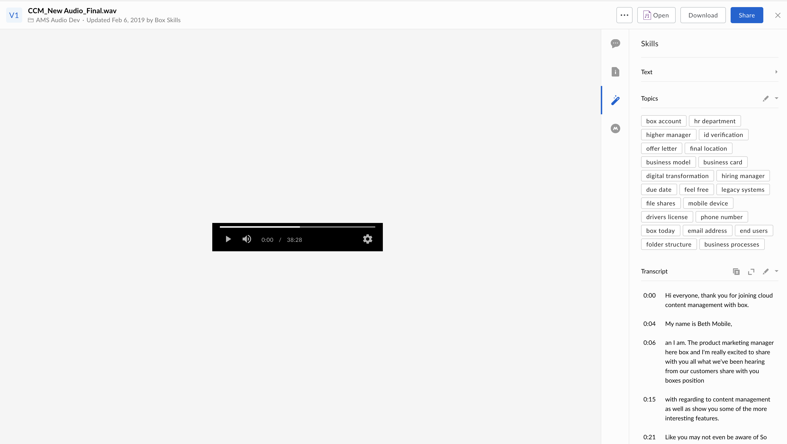

# Microsoft Vision Image Extraction

This is a Box Audio skill that uses the [Microsoft Azure Media Services API](https://docs.microsoft.com/en-us/azure/media-services/latest/analyzing-video-audio-files-concept) to extract Topics, and Transcripts from from audio files and write it back to Box as metadata on the file.



This Skill:

* Supporting file types: 3g2, asf, m2tf, mod, ts, xesc, mpeg, m2v, aiff, mp3, m4b, wma, wav, m4a, flac
* Supporting file sizes: <1 GB
* Supporting languages: Preferred to set explicity as one of en-US', 'en-GB', 'es-ES', 'es-MX', 'fr-FR', 'it-IT', 'ja-JP', 'pt-BR', 'zh-CN', 'de-DE', 'ar-EG', 'ru-RU' or 'hi-IN'. If not set automatic language detection will be employed
* For better development code quality, this skill code also integrates with jest for unittest, and flow (through babel) for typechecking.

## Usage

### Prerequisites

* Make sure to sign up for a [Box Developer](https://developer.box.com/) account and prepare your app for Box skills. See our [developer documentation](https://developer.box.com/docs/box-skills) for more guidance.

### Configuring Serverless

Our Box skills uses the excellent [Serverless framework](https://serverless.com/). This framework allows for deployment to various serverless platforms, but in this example we will use AWS as an example.

To use Serverless, install the NPM module.

```bash
npm install -g serverless
```

Next, follow our guide on [configuring Serverless for AWS](../AWS_CONFIGURATION.md), or any of the guides on [serverless.com](https://serverless.com/) to allow deploying to your favorite serverless provider.

### Deploying

Clone this repo and change into the sample folder.

```bash
git clone https://github.com/box-community/sample-audio-skills
cd sample-audio-skills/microsoft-azure-transcript-topics-detection
```

Then simply deploy the Skill using Serverless.

```bash
serverless deploy -v
```

At the end of this, you will have an invocation URL for your Lambda function.

### Set the invocation URL

The final step is to [configure your Box Skill with the invocation URL](https://developer.box.com/docs/configure-a-box-skill) for your Lambda function. You should have received this in the previous, after you deployed the function for the first time.

Once your new skill is called by our code, the Skill usually takes around a few minutes to hours to process and write the new metadata to the file, depending on the runtime of the audio.
