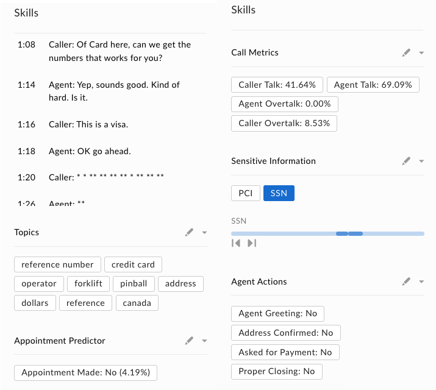

# VoiceBase Dual-Channel Audio Analysis Box Skill 

This Box Skill is targeted towards call center audio file analysis. The service accepts a dual-channel audio file (two speakers) and will use the [VoiceBase](https://www.voicebase.com/) audio analysis APIs to extract the following data segments:

  * *Transcript*: The transcript of the audio file with sensitive information (SSN, PCI) redacted. 
  * *Topics*: The topics of the call using a whitelist of available topics.
  * *Apointment Predictor*: Determination of whether an appointment was scheduled during the call or not.
  * *Call Metrics*: Percentage of caller / agent talk and overtalk.
  * *Sensitive Information*: Whether any sensitive information was detected in the audio, with its location.

## Setting up a New Lambda

  1. Go to https://aws.amazon.com/lambda/ and click "Get Started with AWS Lambda" (log in if needed)
  2. Click on "Create Function" in the top right.
  3. Choose "Author from Scratch" at the top, add any name for your lambda under "Name", choose your "Runtime" (e.g. Node.js 6.10), leave "Role" as "Choose an Existing Role", and select "lambda_basic_execution" under "Existing Role". Click "Create Function" at the bottom.
  4. From the Designer section that loads up, click on the "API Gateway" option within the left list to add it to the project. This will add the ability to have your lambda act as a listener for events that will be sent from Box and the ML / AI systems once processing is complete.
  5. A new "Configure triggers" section will load on the page once the API Gateway option is added. Under the "API" dropdown in that section, click on "Create a New API".
  6. Under the new "Security" dropdown, click "Open", then click the "Add" button in the bottom right.
  7. Click the "Save" button at the top right of the page to save your new lambda. 
  8. At the top of the page, click on the name of your lambda above the "API Gateway" and "Cloudwatch Logs" options. This section will allow you to set the configuration of your app and enter in your lambda code. The "Environment Variables" section will allow you to add in key / value pairs that should be made available in your lambda. 
  9. Within the "Basic Settings" section, set the timeout from 0-3 seconds to 0-30 seconds, then save the lambda again.

## Setting the Lambda Environment Configuration Variables

This sample uses a number of environment variables for the API configuration. To set them, click on your lambda name at the top of the page, then scroll down to the "Environment variables" section. Set the following:

  1. *BOX_CLIENT_ID*: Your client ID from the Skills application on the [Box developer console](https://cloud.app.box.com/developers/console)
  2. *BOX_CLIENT_SECRET*: Your client secret from the Skills application on the [Box developer console](https://cloud.app.box.com/developers/console)
  3. *LAMBDA_INVOKE_URL*: The invoke URL of your lambda. To obtain this, click on the "API Gateway" option at the top (below your lambda name), then expand the "API" section under "API Gateway" at the bottom. This section will include your "API Endpoint".
  4. *VOICEBASE_BEARER_TOKEN*: Your [VoiceBase](https://developer.voicebase.com/) application bearer token.
  5. *VOICEBASE_QUERY_ANALYTICS_KEY*: Your [VoiceBase](https://developer.voicebase.com/) application analytics key.
