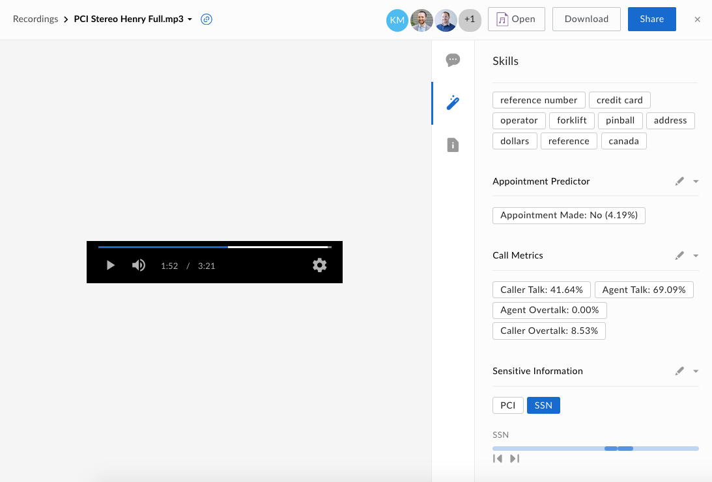

# VoiceBase Dual-Channel Audio Analysis

Use the [VoiceBase API](https://developer.voicebase.com/) to automatically extract data insights from audio files and attach them to your files as metadata.

[VoiceBase](https://www.voicebase.com/) is a speech analytics solutions that is geared towards call center audio file analysis. This Skill accepts a dual-channel audio file (two participants) and will use the [VoiceBase](https://www.voicebase.com/) audio analysis APIs to extract various data.

This skill extracts the following data:

* [*Transcript*](./screenshots/skills_vb.png): The transcript of the audio file with sensitive information (SSN, PCI) redacted. 
* *Topics*: The topics of the call using a whitelist of available topics.
* *Appointment Predictor*: Determination of whether an appointment was scheduled during the call or not.
* *Call Metrics*: Percentage of caller / agent talk and overtalk.
* *Sensitive Information*: Whether any sensitive information was detected in the audio, with its location.

## Usage

### Prerequisites

  * Make sure to sign up for a [VoiceBase Developer](https://developer.voicebase.com) account and obtain a VoiceBase API Bearer Token.
  * Make sure to sign up for a [Box Developer](https://developer.box.com/) account and prepare your app for Box skills. See our [developer documentation](https://developer.box.com/docs/box-skills) for more guidance. 

### Prepare AWS Lambda

For this sample, we will be deploying a new serverless function to [AWS Lambda](https://aws.amazon.com/lambda/).

  1. Go to [https://aws.amazon.com/lambda/](aws.amazon.com/lambda)
    * Log in if needed
    * Click **Get Started with AWS Lambda** 
    * Click on **Create Function** in the top right
  1. Choose **Author from Scratch** at the top
    * add any name for your Lambda function under **Name**
    * choose your **Runtime** (e.g. Node.js 8.10)
    * leave **Role** as **Choose an Existing Role** and select **lambda_basic_execution** under **Existing Role**
    * Click **Create Function** at the bottom.
  1. From the Designer section click on the **API Gateway** option within the left list 
    * This will add the ability to have your function act as a listener for events that will be sent from Box and the ML / AI systems once processing is complete.
  1. A new **Configure triggers** section will load on the page once the API Gateway option is added
    * Under the **API** dropdown in that section, click on **Create a New API**.
  1. Under the new **Security** dropdown, click **Open**
    * Then click the **Add** button in the bottom right
  1. Click the **Save** button at the top right of the page to save your new Lambda function. 
  1. At the top of the page, click on the name of your Lambda function above the **API Gateway** and **Cloudwatch Logs** options. 
    * This section will allow you to set the configuration of your app and enter in your function code. 
    * The **Environment Variables** section will allow you to add in key / value pairs that should be made available in your code. 
  1. Within the **Basic Settings** section, set the timeout from *0-3* seconds to *0-30* seconds, then save the Lambda function again.

## Configure AWS Lambda Environment Variables

This sample uses a number of environment variables for the API configuration. To set them, click on your lambda name at the top of the page, then scroll down to the "Environment variables" section. Set the following:

  1. `BOX_CLIENT_ID`: Your client ID from the Skills application on the [Box developer console](https://cloud.app.box.com/developers/console)
  2. `BOX_CLIENT_SECRET`: Your client secret from the Skills application on the [Box developer console](https://cloud.app.box.com/developers/console)
  3. `LAMBDA_INVOKE_URL`: The invoke URL of your Lambda. To obtain this, click on the **API Gateway** option at the top (below your Lambda function name), then expand the **API** section under **API Gateway** at the bottom. This section will include your **API Endpoint**.
  4. `VOICEBASE_BEARER_TOKEN`: Your [VoiceBase](https://developer.voicebase.com/) application bearer token.

## Deploy Box Skill to AWS Lambda

To deploy the code to listen for audio file upload events on Box:

  1. Download or clone this repo.
  1. Change into the `voicebase-callcenter-audio-analysis` folder
  2. Run `npm install` to download all required Node packages
  3. Zip all contents of the folder into a new `.zip` file

With the `.zip` file created, follow these steps to upload it to your lambda:

  1. Within your AWS Lambda console, click on the name of your function at the top within the "Designer" section.
  2. In the **Function Code** section, select **Upload a .zip file** in the **Code entry type** dropdown
  3. Click the **Upload** button and select the `.zip` file you created
  4. Once uploaded, click on the **Save** button at the top right of your function

Your Lambda function is now ready to start accepting upload events from Box Skills.

## Frequently Asked Questions

### Who might use this Skill?
This Skill enables many automatic data insights that would have typically been done by an individual manually listening the the entire audio conversations, which is ideal for call centers that need to process many audio files in a given day, or simply when manual review of stored conversations is not possible. 

### What types of files does this Skill handle?
This Skill will handle any dual channel audio files in the following formats: `*.mp3`, `*.mp4`, `*.flv`, `*.wmv`, `*.avi`, `*.mpeg`, `*.aac`, `*.aiff`, `*.au`, `*.ogg`, `*.3gp`, `*.flac`, `*.ra`, `*.m4a`, `*.wma`, `*.m4v`, `*.caf`, `*.cf`, `*.mov`, `*.mpg`, `*.webm`, `*.wav`, `*.asf`, `*.amr`

### What metadata is written back to my Box file?
The following data will be written back to the original audio file, as Skills cards:

  * *Transcript*: The transcript of the audio file with sensitive information (SSN, PCI) redacted. 
  * *Topics*: The topics of the call using a whitelist of available topics.
  * *Appointment Predictor*: Determination of whether an appointment was scheduled during the call or not.
  * *Call Metrics*: Percentage of caller / agent talk and overtalk.
  * *Sensitive Information*: Whether any sensitive information was detected in the audio, with its location.

### What implications does this have for my business?
Audio analysis is a very costly, yet valuable, process. The insights garnered from an audio file can allow you to build an analysis of typical customer requests, issues, and needs, as well as gage the effectiveness of the call agents. With these insights your business can run smartly, tracking metrics based on actual customer needs and experiences.
