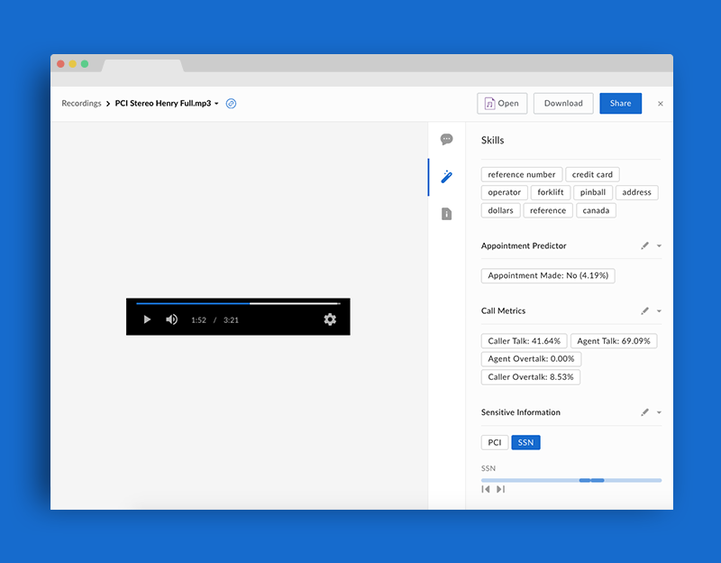

# VoiceBase Dual-Channel Audio Analysis

Use the [VoiceBase API](https://developer.voicebase.com/) to automatically extract data insights from audio files and attach them to your files as metadata.



## About VoiceBase

[VoiceBase](https://www.voicebase.com/) is a speech analytics solutions that is geared towards call center audio file analysis. This Skill service is set up using AWS Lambda and accepts a dual-channel audio file (two speakers) and will use the [VoiceBase](https://www.voicebase.com/) audio analysis APIs to extract the following data segments:

  * *Transcript*: The transcript of the audio file with sensitive information (SSN, PCI) redacted. 
  * *Topics*: The topics of the call using a whitelist of available topics.
  * *Appointment Predictor*: Determination of whether an appointment was scheduled during the call or not.
  * *Call Metrics*: Percentage of caller / agent talk and overtalk.
  * *Sensitive Information*: Whether any sensitive information was detected in the audio, with its location.

## Usage

### Prerequisites

  * Make sure to sign up for a [VoiceBase Developer](https://developer.voicebase.com) account and obtain a VoiceBase API Bearer Token.
  * Make sure to sign up for a [Box Developer](https://developer.box.com/) account and prepare your app for Box skills. See our [developer documentation](https://developer.box.com/docs/box-skills) for more guidance. 

### Configuring Serverless

Our Box skills uses the excellent [Serverless framework](https://serverless.com/). This framework allows for deployment to various serverless platforms, but in this example we will use AWS as an example.

To use Serverless, install the NPM module.

```bash
npm install -g serverless
```

Next, follow our guide on [configuring Serverless for AWS](../AWS_CONFIGURATION.md), or any of the guides on [serverless.com](https://serverless.com/) to allow deploying to your favorite serverless provider.

### Deploying

Clone this repo and change into the Rossum folder.

```bash
git clone https://github.com/box-community/sample-document-skills
cd sample-document-skills/rossum-invoice-intelligence
```

Then change the environment variables in your `serverless.yml` file with the following.

1. `BOX_CLIENT_ID`: Your client ID from the Skills application on the [Box developer console](https://cloud.app.box.com/developers/console)
1. `BOX_CLIENT_SECRET`: Your client secret from the Skills application on the [Box developer console](https://cloud.app.box.com/developers/console)
1. `VOICEBASE_BEARER_TOKEN`: Your [VoiceBase](https://developer.voicebase.com/) application bearer token.

```yaml
...

functions:
  index:
    ...
    environment:
      BOX_CLIENT_ID: YOUR_BOX_CLIENT_ID
      BOX_CLIENT_SECRET: YOUR_BOX_CLIENT_SECRET
      VOICEBASE_BEARER_TOKEN: YOUR_VOICEBASE_BEARER_TOKEN
```

Finally, deploy the Skill.

```bash
serverless deploy -v
```

## Frequently Asked Questions

### Who might use this Skill?
This Skill enables many automatic data insights that would have typically been done by an individual manually listening the the entire audio conversations, which is ideal for call centers that need to process many audio files in a given day, or simply when manual review of stored conversations is not possible. 

### What types of files does this Skill handle?
This Skill will handle any dual channel audio files in the following formats: *.mp3, *.mp4, *.flv, *.wmv, *.avi, *.mpeg, *.aac, *.aiff, *.au, *.ogg, *.3gp, *.flac, *.ra, *.m4a, *.wma, *.m4v, *.caf, *.cf, *.mov, *.mpg, *.webm, *.wav, *.asf, *.amr

### What metadata is written back to my Box file?
The following data will be written back to the original audio file, as Skills cards:

  * *Transcript*: The transcript of the audio file with sensitive information (SSN, PCI) redacted. 
  * *Topics*: The topics of the call using a whitelist of available topics.
  * *Appointment Predictor*: Determination of whether an appointment was scheduled during the call or not.
  * *Call Metrics*: Percentage of caller / agent talk and overtalk.
  * *Sensitive Information*: Whether any sensitive information was detected in the audio, with its location.

### What implications does this have for my business?
Audio analysis is a very costly, yet valuable, process. The insights garnered from an audio file can allow you to build an analysis of typical customer requests, issues, and needs, as well as gage the effectiveness of the call agents. With these insights your business can run smartly, tracking metrics based on actual customer needs and experiences.
